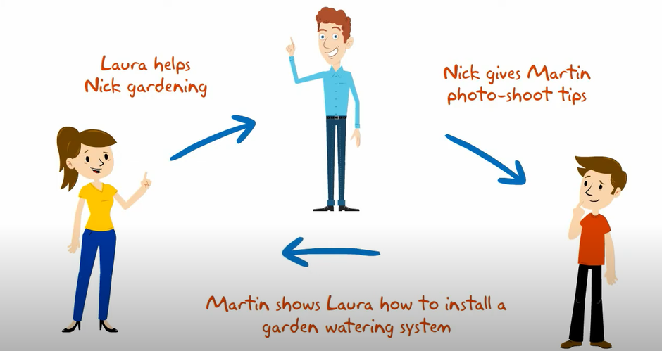

Disclaimer: This proposal represents my original thinking and research; I leveraged generative AI strictly as a sophisticated editor to polish the delivery of my ideas.

  

    
  

## Overview
*The problem*:  Most students often have valuable skills—academic, creative, or practical—but there is no easy, structured way to share them. At the same time, students miss opportunities to learn useful real-world skills from their peers in a collaborative, low-pressure environment. 

*The solution*:  SkillSwap is an application that allows students to exchange skills with one another through a structured, community-driven platform. Instead of focusing only on academic tutoring, SkillSwap expands into all types of knowledge sharing. Students can teach skills they are confident in and request help in areas they want to improve, creating a balanced ecosystem of peer-to-peer learning.

## Approach
To use SkillSwap, a student must log in and create a profile. In their profile, they list:
  - Skills they can teach (e.g., surfing, video editing, guitar, coding)
  - Skills they want to learn
  - Availability for meetups (in-person or virtual)
  - A short bio and optional profile photo

Each student becomes both a mentor and learner, depending on the skill.

Another section of the site organizes skills into categories (e.g., Academics, Arts, Technology, Life Skills). Within each category:
  - Users can browse available “mentors” and “learners”
  - Each skill listing shows who is offering help and who is requesting it
 
A student can create a Skill Session, which includes:
  - The skill/topic (e.g., “Intro to Crocheting” or “Basic guitar chords”)
  - Type of session (teaching or collaborative)
  - Time and location (or virtual link)
  - Number of participants allowed

  
This session generates notifications to relevant users who either:
  - Want to learn that skill, or
  - Have listed that skill as something they can teach

Users can respond by joining the session.

There is also a calendar system that displays all upcoming sessions, along with participant lists.

There are two main styles of use for SkillSwap:
1. Planned Learning:
A student schedules a session in advance to learn or teach a skill. Others can sign up ahead of time.
2. Instant Help (“Right Now” Mode):
A student needs immediate help (e.g., stuck on homework or practicing a skill). They can create a “Right Now” request, notifying nearby or available users for quick assistance.

SkillSwap addresses the challenge of students feeling hesitant to share or ask for help by using game mechanics such as points, badges, levels, and leaderboards to encourage participation, along with optional rewards for active users. To prevent misuse, the platform includes attendance verification, session ratings, and admin monitoring to ensure meaningful participation and avoid fake sessions. Administrators also oversee user activity, manage reports, and maintain a safe environment. Overall, SkillSwap is designed to promote peer-to-peer learning, build a stronger community, increase confidence in both teaching and learning, support in-person and virtual collaboration, and ensure an inclusive and safe space for all students.

It is not meant to replace classroom learning or formal tutoring systems. Instead, it enhances them by enabling real-world interaction, collaboration, and skill-building among peers.

## Mockup page ideas
Some possible mockup pages include:
  - Landing page
  - User home/dashboard
  - Admin dashboard
  - User profile page
  - Skill browsing page (by category)
  - Create Skill Session page
  - Session details page
  - Calendar page
  - Notifications page
  - Game mechanics page (badges, leaderboard, levels)

## Use case ideas
New user visits landing page, logs in, and creates a profile (How do they discover how SkillSwap works?)
User browses skills and joins a session
User creates a Skill Session and receives responses
User receives a notification and joins a “Right Now” help session
Admin logs in and moderates content or users
User checks their progress (points, badges, level)

## Beyond the basics
After implementing core features, here are ideas for advanced functionality:
  - Text message notifications for session updates and confirmations
  - Integration with school platforms (e.g., Google Classroom or Slack)
  - AI-powered skill matching (suggest people you should connect with)
  - Reputation system based on ratings and feedback
  - Mini skill courses (structured multi-session learning paths)
  - QR code check-ins for session attendance verification
	
