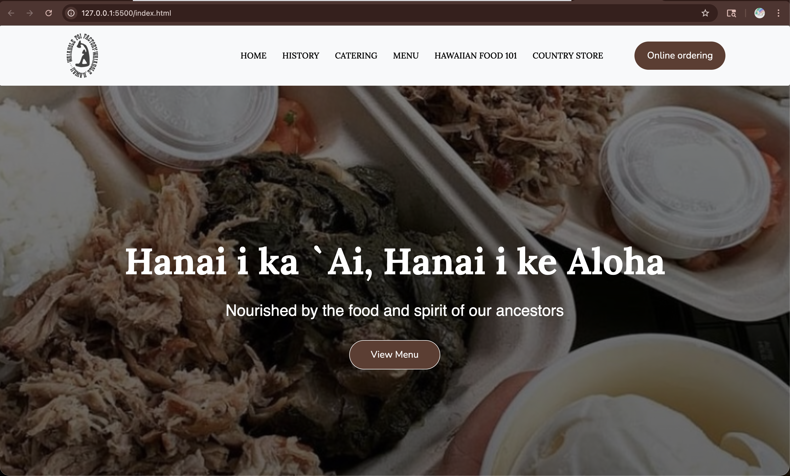
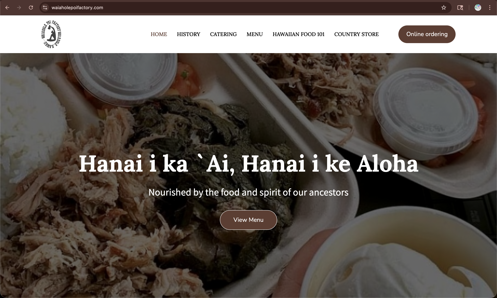

  

    
  

  

      
  

## First Impressions of UI Frameworks

Over the past few weeks, I had the opportunity to explore Bootstrap 5 through a series of assignments that gradually increased in difficulty. Up until this point, my coding experience had been strictly functional, so transitioning to a UI framework meant stepping into genuinely unfamiliar territory.

Working with a framework was not as effortless as the final results might suggest. I had to learn new syntax, patterns, conventions, and constraints all at once. In many ways, it felt like picking up a new programming language — it was easy to get lost navigating Bootstrap's extensive documentation and feature set, especially under the time pressure of this class.

## The Case for Mobile-First Design

Despite the initial overwhelm, I have come to appreciate the structure, scalability, and efficiency that Bootstrap provides. It streamlines the process of building webpage layouts while enforcing a level of discipline that keeps code maintainable as projects grow.

Its mobile-first design philosophy is particularly valuable for those newer to web design and HTML/CSS. Rather than retrofitting a desktop layout for smaller screens, Bootstrap encourages designing with mobile in mind from the start — saving considerable effort and ensuring content adapts naturally across devices. As mobile continues to become the dominant way people access the web globally, this approach feels increasingly essential rather than optional.

## Where Bootstrap Falls Short

That said, Bootstrap is not without its drawbacks. For smaller projects, importing the full framework can feel unnecessarily heavy. Customizing beyond its default styles often requires overriding multiple classes, which can quickly become tedious and harder to maintain. Upgrading to newer versions also carries the risk of breaking existing code, adding refactoring overhead that may not always be worth the trade-off.

## Front-End Development and Me

Despite these challenges, I found myself genuinely enjoying the process of bridging creativity and functionality. Reading pieces like 7 Rules for Creating Gorgeous UI and Clean Up Your Mess: A Guide to Visual Design for Everyone helped me draw an unexpected parallel to my work at a print shop, where carefully reviewing a digital design before it goes to print is essential — any error that slips through becomes permanent. Front-end development carries a similar responsibility: the output on screen must match what was envisioned, and the details matter. That connection made the work feel less abstract and more purposeful.

---
Note: AI tools were used to support my writing process in this essay, mainly to improve clarity and refine wording. However, all ideas and concepts presented are my own.

