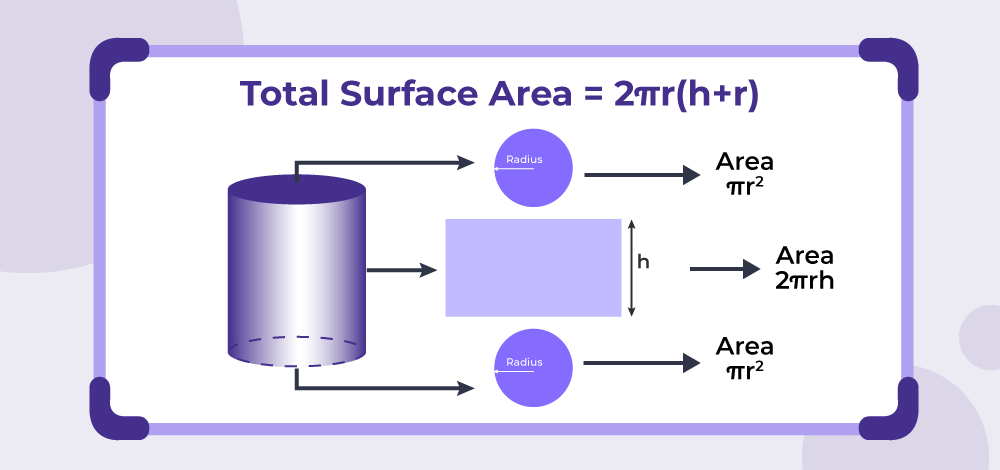

Circle and Cylinder is a C++ project I developed to practice object-oriented programming and explore inheritance and method overriding. The program models circle and cylinder classes, calculates area, surface area, and volume, and automatically corrects invalid inputs like negative or zero values. 

I tested the classes by creating objects with preset values and verifying the calculations, which helped me understand how constructors, setters, and overridden methods work in practice. 

In the future, the program could be extended to take user input and include additional shapes, making it a more flexible and reusable tool. This project was a great way to apply the programming concepts I’ve learned while designing classes that are both robust and practical. 

Here is a sample output demonstrating the results of a single execution of the program:

<pre>
Test Circle class default constructor and area() function:
Circle circle1: radius = 1
area = 3.14159

Test Circle class constructor with radius (-10):
Circle circle2: radius = 1
Test set method, set circle2 to radius -5...
radius = 5
area = 78.5398

Test Cylinder class given radius (20) and height (-30):
Cylinder cylinder1: radius = 20; height = 30
surface area = 6283.19
volume = 37699.1

Test set method, set cylinder1 to radius (0) and height (0)...
radius = 0; height = 1
surface area = 0
volume = 0
</pre>

