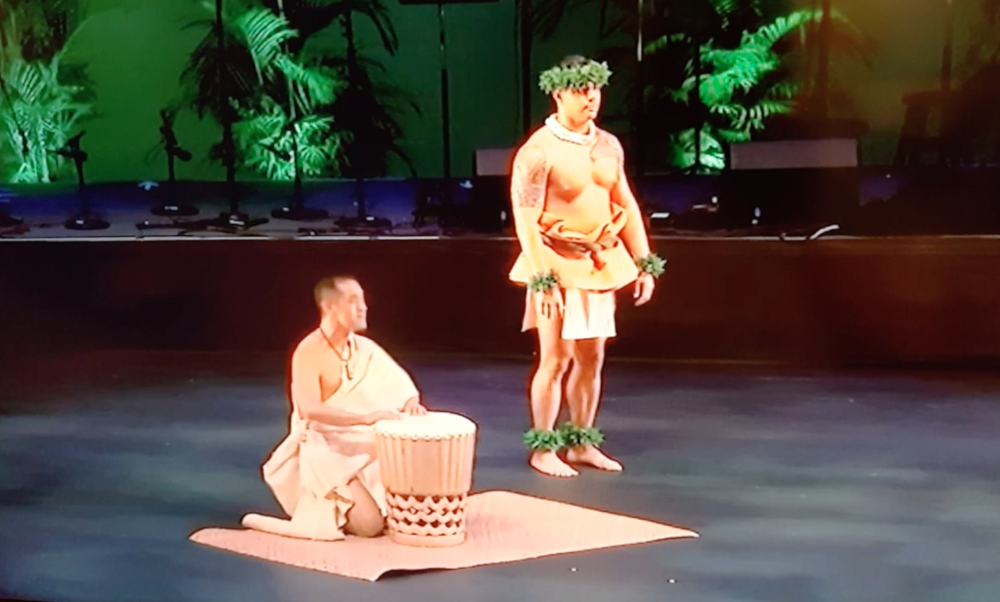

  
  

# Guidlines
For this assignment, I was required to choose a professional dancer and conduct a filmed interview lasting at least five minutes. I needed to use two different filming techniques and include at least 50% B-roll footage on a tripod that complemented the narrative and served as cutaways. I also had to implement proper lighting and utilize separate audio recordings to ensure the video was clear and visually appealing.

# Content
I interviewed my uncle Ikaika, a kumu hula at an elementary school in Maui who has performed in multiple Merrie Monarch Festivals. The documentary focused on his hula journey, exploring his experiences as a dancer, educator, and cultural practitioner. Through the interview and supporting footage, the video highlighted the discipline, creativity, and cultural responsibility involved in hula. 

# Insight
Completing this project helped me develop skills in planning, organization, time management, and storytelling through visual media. I learned how to conduct meaningful interviews, capture and edit footage to tell a cohesive story, and deliver a professional project from start to finish.
 

For the full video, visit [here](https://drive.google.com/file/d/1j0Rti23XF28qa6LtpA2yoVjYVKzuJbj5/view?usp=sharing).
