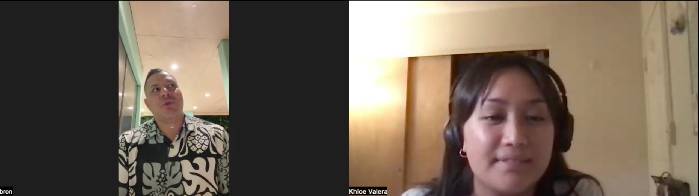
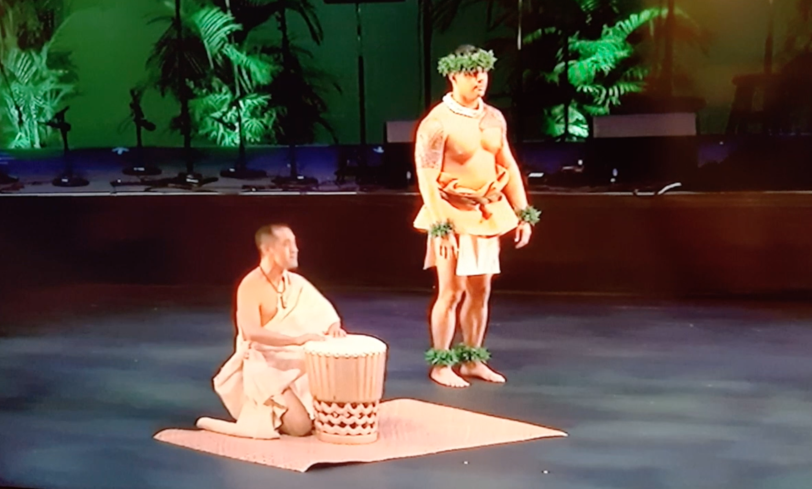

  
  

# Building the Documentary
For this project, I was tasked to film and edited a documentary-style interview with a professional dancer, running at least five minutes in length. The work required two distinct filming techniques, at least 50% B-roll footage shot on a tripod, proper lighting, and separate audio recording — all working together to produce something visually and narratively cohesive. Throughout the editing process, I focused on using these technical requirements not just to meet the assignment criteria, but to strengthen the emotional tone of the documentary. The combination of interview footage, performance clips, and carefully framed B-roll helped create a more immersive experience that allows the audience to connect with both the subject and the cultural significance behind the story.

# Capturing His Story
This documentary centers on an interview with my maternal uncle, Ikaika Bronson Bajo, a dedicated practitioner who specializes in the art of hula. His lifelong commitment to the practice earned him multiple appearances at the Merrie Monarch Festival and culminated in his certification as a kumu hula mentoring Hawaiʻi’s youth. I created this project to examine the profound responsibility he carries as a dancer, educator, and cultural steward. The narrative weaves his personal testimony with visuals that reflect the intense discipline and creativity central to hula. By juxtaposing rigorous rehearsal scenes with performance and behind-the-scenes footage, the film illustrates that hula is not entertainment, but a vital vehicle for generational storytelling, cultural preservation, and Hawaiian resistance. In capturing both the preparation and the performance, the documentary exposes the unseen dedication and pride thriving far beyond the edge of the stage.

# What This Project Taught Me
This project changed how I think about storytelling. Learning to shape an interview into a cohesive narrative — deciding what to keep, what to cut, and what the footage should say on its own — pushed me in ways a written assignment never could. More than technical skills, I came away with a deeper appreciation for my uncle's work and a clearer sense of how visual media can honor a story rather than just document it. Watching the final documentary come together also made me realize how much meaning can be communicated through pacing, visuals, sound, and emotion rather than dialogue alone. It taught me that documentaries are not only about presenting information, but about creating connection and allowing viewers to experience someone else's perspective in a more personal and impactful way.

View the documentary <a href="https://www.youtube.com/watch?v=1e_Z09135ls">here.</a>
