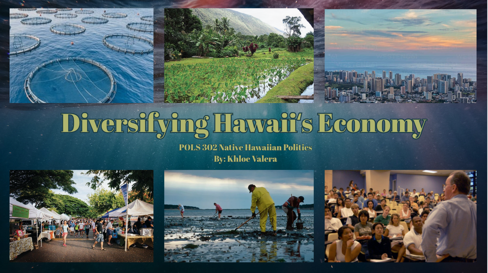
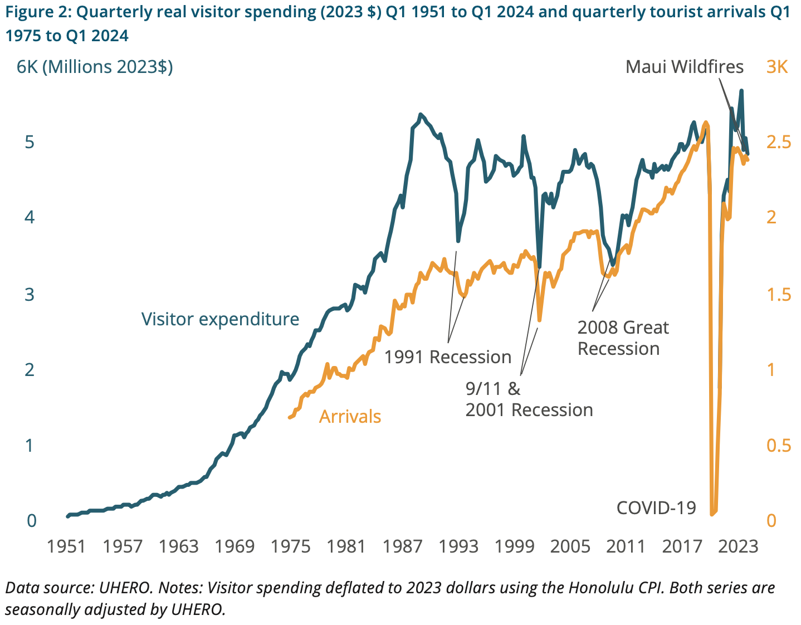
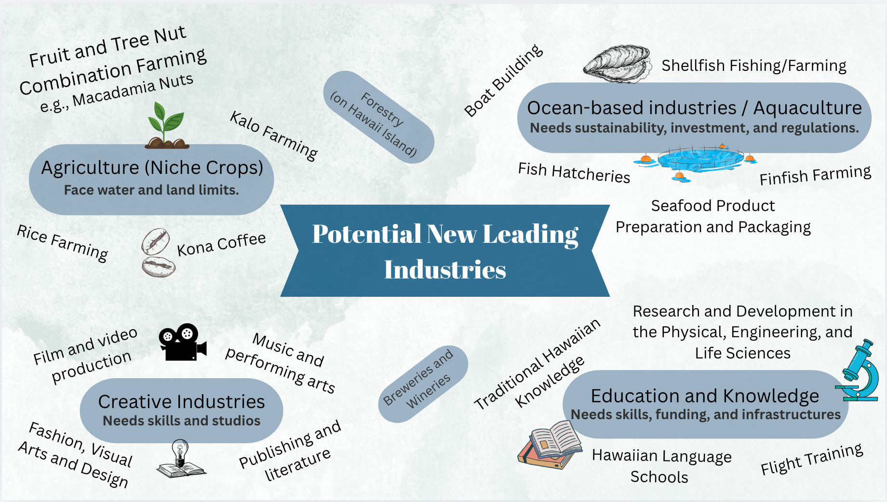

  

## Five Weeks of Research
During my POLS 302 course on Native Hawaiian Politics, I was given an opportunity to present a related topic of my choosing to the class. For five weeks, I explored material related to Hawaiʻi’s economy and came to see how imperative it is to diversify it in a way that keeps Hawaiian perspectives at the center. I researched different strategies like tourism, agriculture, renewable energy, and technology, looking at both the opportunities and the cultural or ecological impacts. I contributed by gathering sources, analyzing policies, and summarizing ideas about sustainability and equity, which helped me connect research with real-world applications.

  
  

## Weaving It Together
In the book _He Lei Aloha ʻĀina_, Mehana Blaich Vaughan likens her research to lei weaving, a strategy I used to create a cohesive understanding of Hawaiʻi’s economy. I plan to apply this same approach to coding. What I’ve learned through this project is that—like research—coding is rarely linear: you gather information, interpret it, and often have to revisit and revise your approach multiple times. Drawing on experiences outside of programming enriches projects, providing crucial context that leads to more impactful work, better problem-solving, and stronger collaboration.

View presentation <a href="https://canva.link/kumupresentation">here.</a>