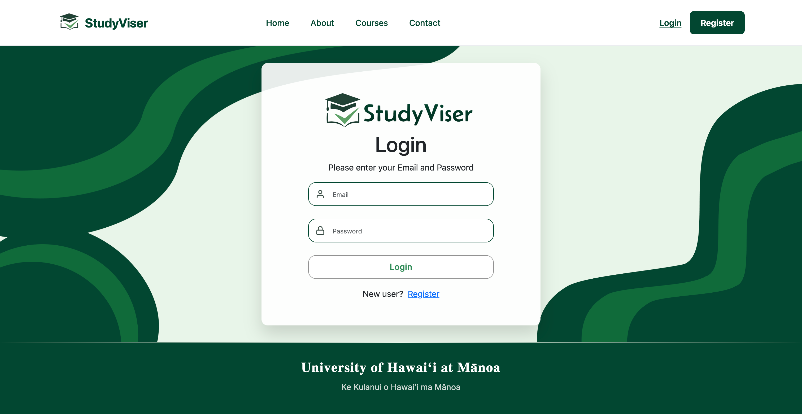
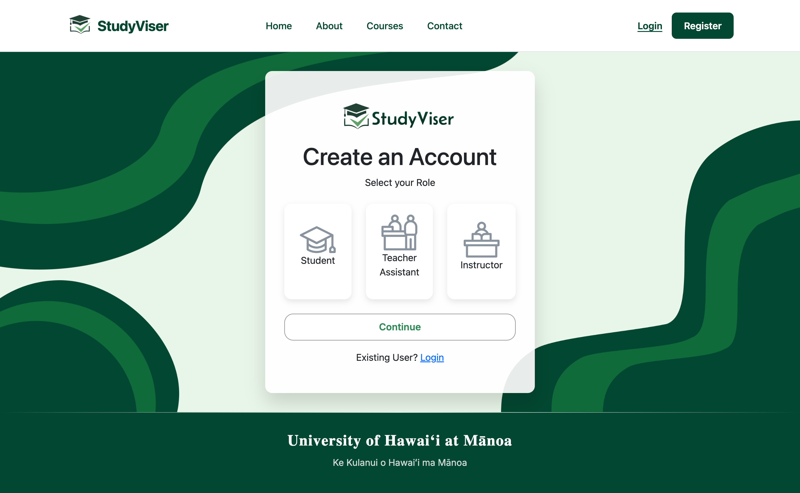
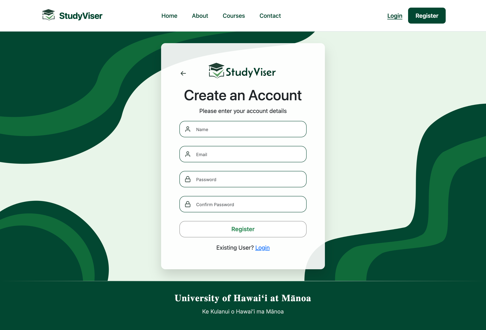
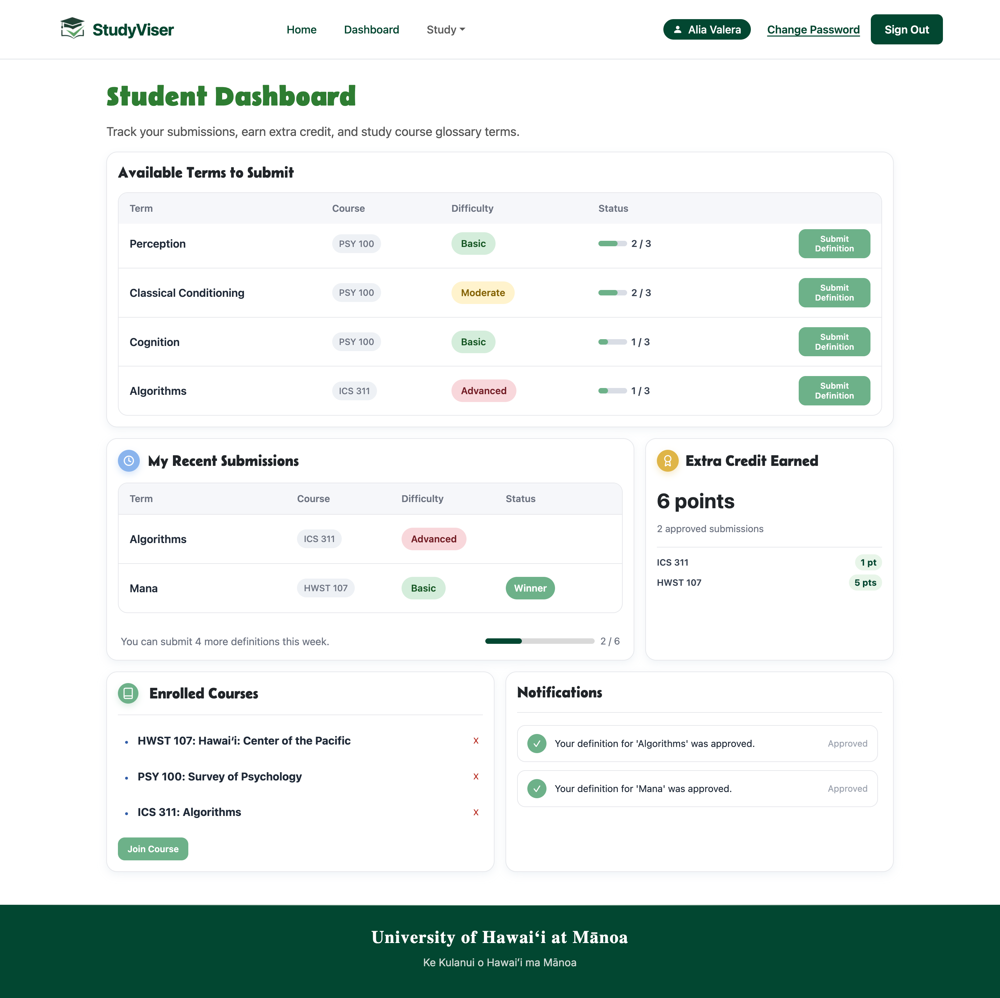
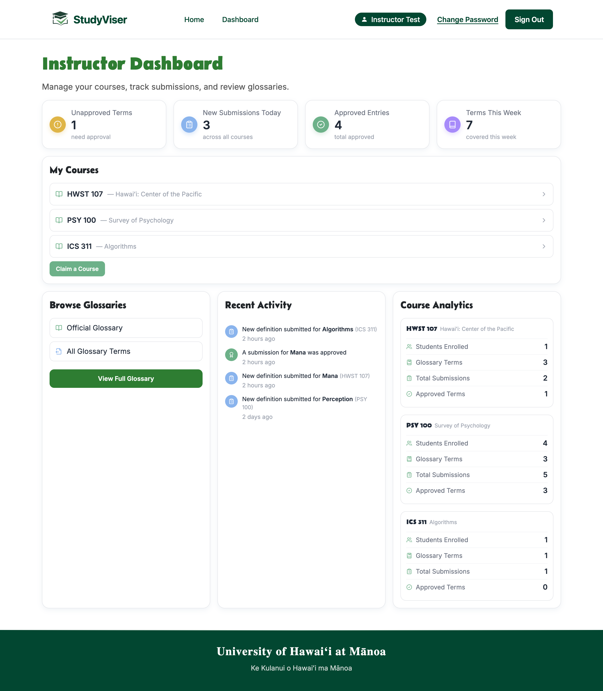

## Introduction to StudyViser
StudyViser is a collaborative web application that my team and I developed for ICS 314 during Spring 2026. The platform was designed to help students create, organize, and share study materials for their courses in a centralized and accessible way. In addition to improving access to course resources, StudyViser also allows students to earn extra credit through instructor-approved contributions such as glossary definitions and study submissions. The goal of the platform was to encourage collaboration while making course expectations and learning materials easier to understand and navigate.

## Technologies and Development
The project was built using modern full-stack web development technologies including Next.js and React for the frontend, Bootstrap 5 and React Bootstrap for responsive user interface design, and PostgreSQL with Prisma for database management and data modeling. Authentication and user session management were implemented using NextAuth.js, while React Hook Form was used to manage forms, user input, and validation. Throughout development, we focused on creating a clean and responsive interface that could support different types of users, including students and instructors.

  

    
  

  

    
  

  

    
  

## My Contributions
My main contributions to the project focused on frontend development, form integration, and connecting user interactions with backend functionality. I worked on creating and styling several important forms within the application, including the course joining form, glossary term submission form, and student definition submission form. I also helped connect static pages to live database data so that information displayed dynamically based on the logged-in user and their enrolled courses.

In addition, I contributed to features related to course enrollment, glossary term management, and the student dashboard experience. This included helping implement workflows where students could submit study material for instructor approval and receive extra credit once approved. I also worked on improving the user interface design and overall user experience by refining layouts, styling components, and organizing information in a way that felt intuitive and visually cohesive.

  

    
  

  

    
  

## Teamwork and Software Engineering Experience
Working on StudyViser gave me valuable experience in collaborative software engineering and agile development workflows. Since the project was developed as a team, communication and coordination were essential throughout the process. We used GitHub for version control, issue tracking, and task delegation, which helped us organize responsibilities and manage progress efficiently. Through this experience, I strengthened my understanding of collaborative coding practices, debugging, and integrating multiple features into a single cohesive application.
 
## Professional Development and Skills Gained
The project also introduced me to modern software development practices used in professional environments. These included automated testing with Playwright, code linting with ESLint, and continuous integration and deployment using GitHub Actions. Beyond technical skills, the experience improved my ability to problem-solve, adapt to unfamiliar technologies, and work through real-world development challenges as part of a team. Overall, StudyViser helped me build confidence in full-stack web development while giving me a stronger understanding of how modern web applications are designed, developed, and maintained.

View our<a href="https://study-viser.vercel.app/"> deployed</a> app, 
<a href="https://github.com/study-viser/study-viser">repository</a>, and <a href="https://study-viser.github.io/">organization</a> page.
